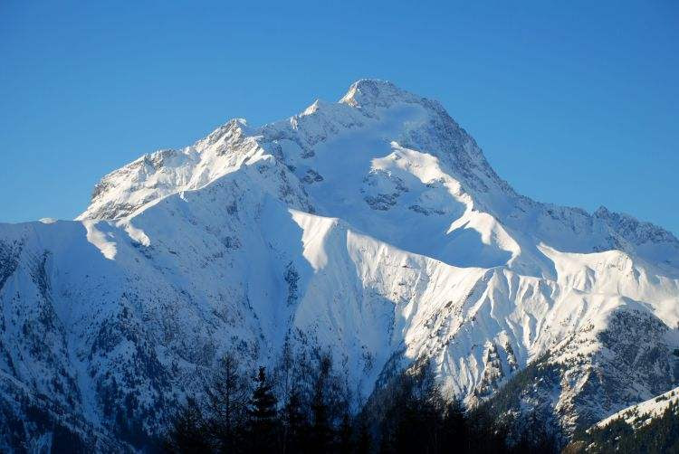

## Oh my..what an experience!

Een unieke ervaring. Iedereen die al eens in Les Deux Alpes geweest is, heeft deze mythische berg willens nillens sowieso al op het netvlies gehad. De hoofdstraat in het dorp heet Avenue de la Muzelle en lijkt je letterlijk de berg op te brengen..

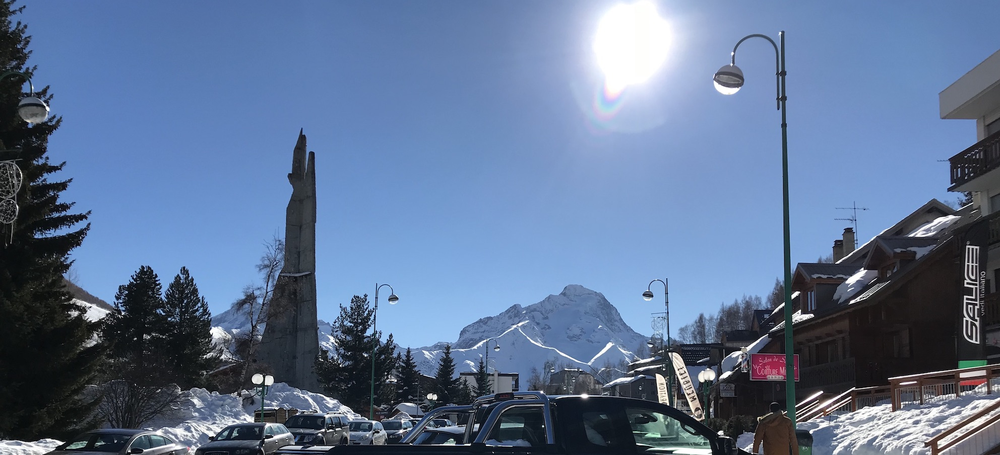

Deze tweedaagse tocht doe je niet zomaar. Dat jaar vertoefde ik er het hele seizoen, en we waren diep in maart de eerste groep die hem beklom. Heel het dorp, alle locals zijn in de ban van de berg die dagelijks op hen neerkijkt, en heel het dorp heeft het dus ook geweten als iemand de La Muzelle gaat beklimmen.

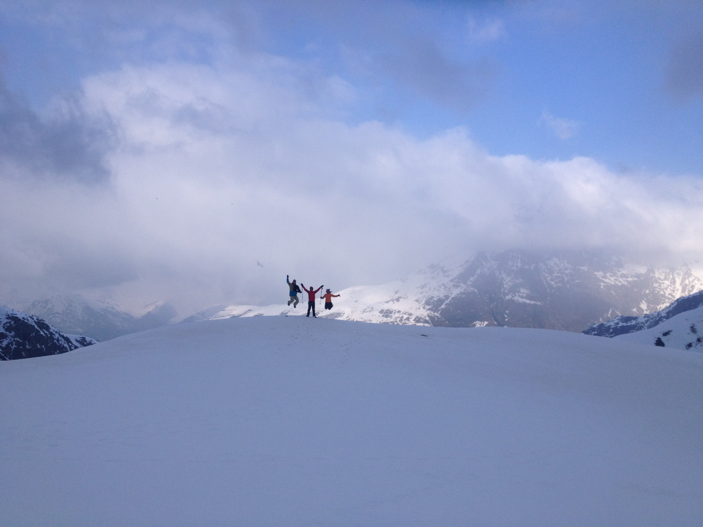

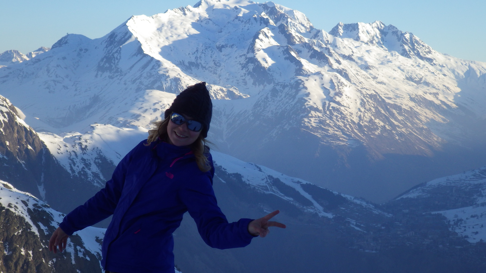

Omdat ik daar in de lokale klimclub zat, had ik het geluk om daar heel wat locals te leren kennen met dezelfde passies. Hun projectje dat jaar was La Muzelle, en daarvoor namen ze een locale gids onder de armen. Dus mét gids en enkele ervaren klimmers, die allen over een topconditie beschikten, ondernamen we de tocht.

<iframe width="560" height="315" src="https://www.youtube.com/embed/3SVywCHaIDs" frameborder="0" allow="accelerometer; autoplay; encrypted-media; gyroscope; picture-in-picture" allowfullscreen></iframe>

## Eerste deel: Venosc tot Lac de La Muzelle

Het was een warme winter, en de sneeuw was in het dorp van Venosc (op minder dan 1000 meter) al fel verdwenen. Het eerste deel werd dus hiken, met al ons materiaal op onze rug.

<!-- 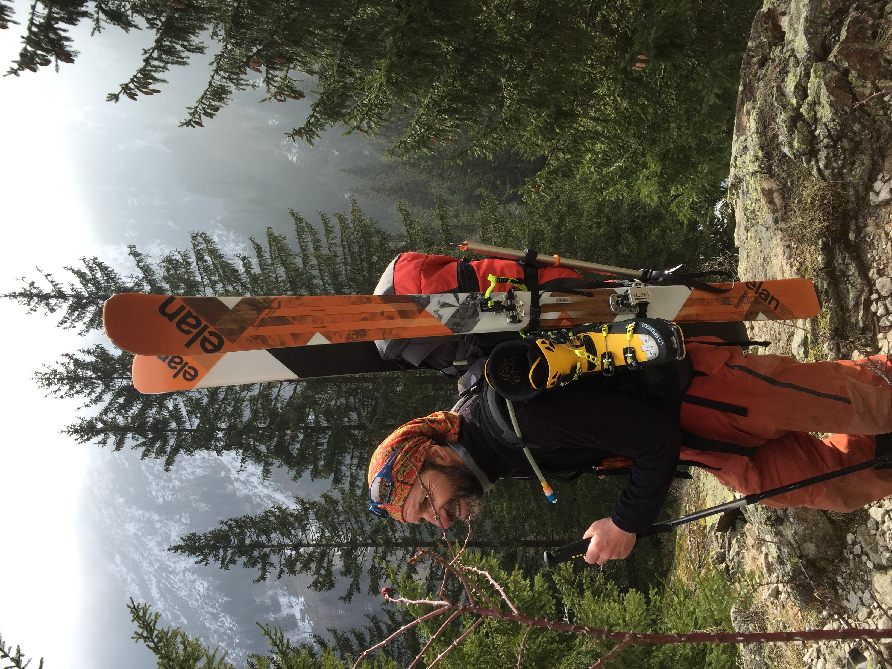 -->
<!-- 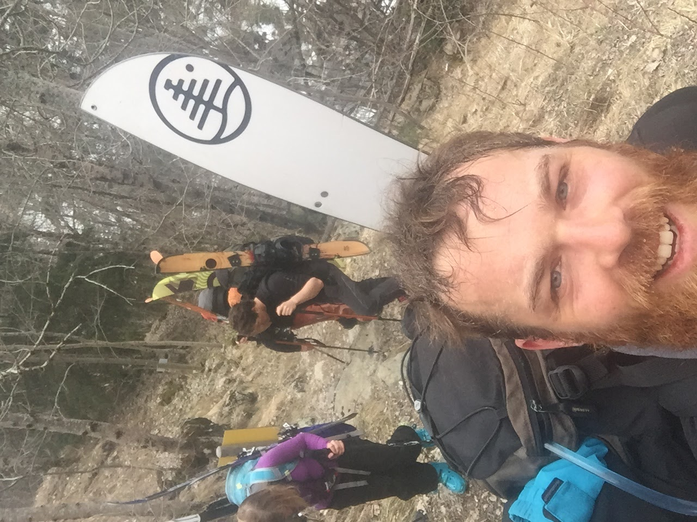 -->
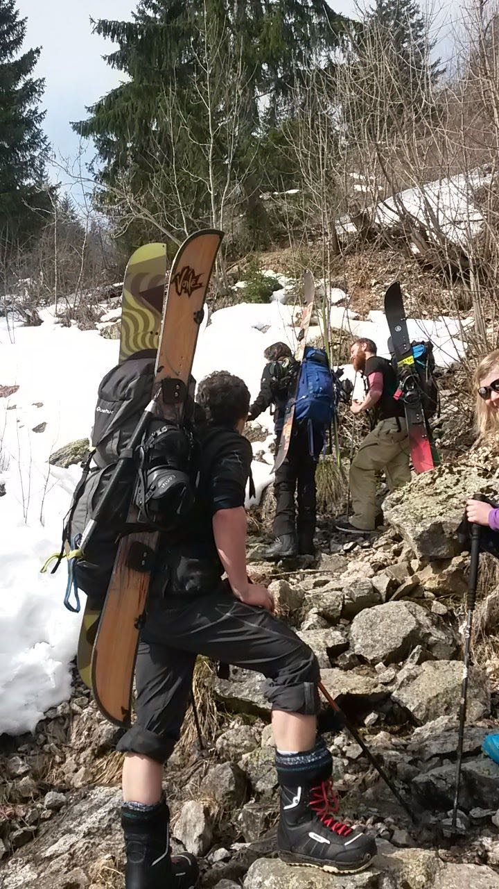

## Overnachten

Als je in het holst van de nacht vertrekt, en een ervaren tourskiër bent, kan je de tocht in één keer doen. Echter, als je maar in de late namiddag de top bereikt, en met de warmte van midden maart al (in volle zon), heb je heel veel meer gevaar op lawines bij het snowboarden/skiën naar beneden.

Bovendien is het ook aangenaam om de tocht in 2 dagen te doen. Er is een refuge, die enkel bemand is in de zomer, aan het Lac de la Muzelle, ergens in het midden op de tocht. De vertrekken van in de zomer zijn dicht, maar er is een mini hutje bij die steeds open is, met een keukentje en enkele stapelbedden. Genoeg om er de nacht door te brengen en even te rusten op weg naar de top.

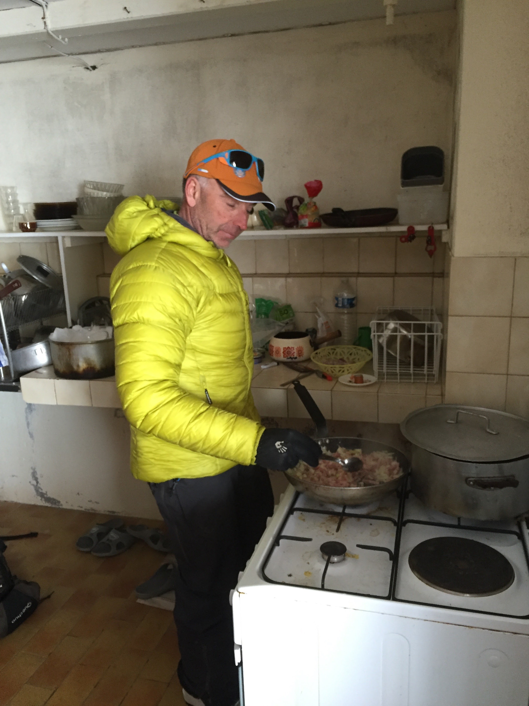

## Memorabele momenten op weg naar de top

### De steile weg naar boven

De 2de dag begon met de "crampons" aan de voeten. Ijzig en zeer steil. Maar we waren meteen opgewarmd. :-)

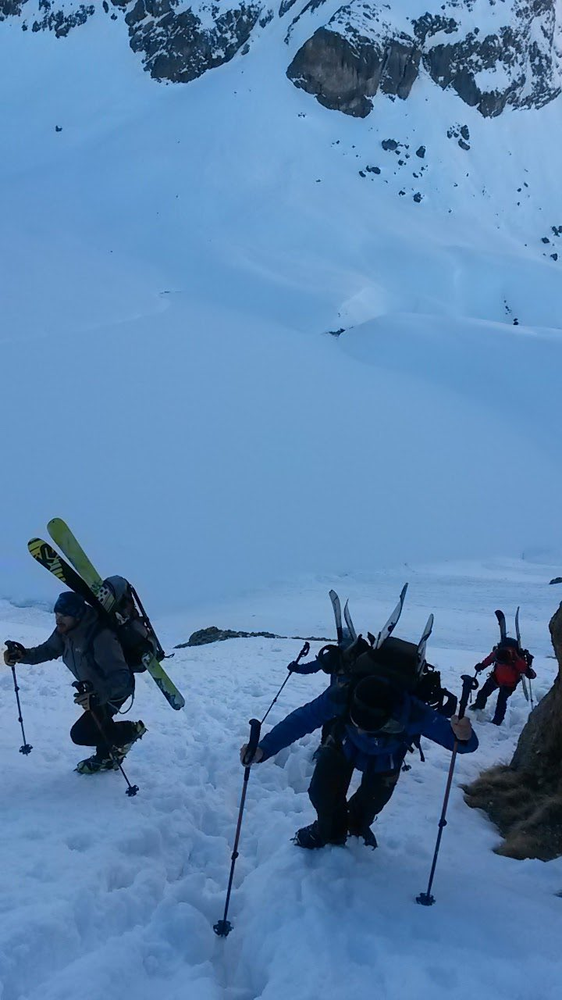

### De bergkammen op weg naar La Muzelle

Dit had ik nooit eerder gedaan, toch niet op die manier. Zowel links als rechts een steile wand naar beneden, je voelt je echt op de top van de wereld.

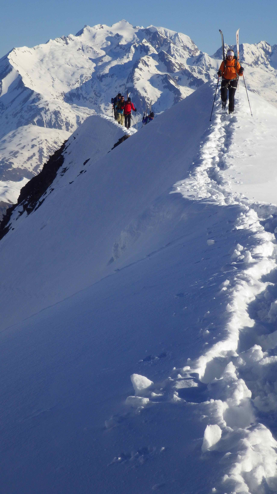

### De laatste loodjes

Eens rond het "oog van de La Muzelle" begon nog een steile klim op de gletcher naar boven. Boven de 3200 meter was dit wel nog even zwoegen, maar dikke fun.

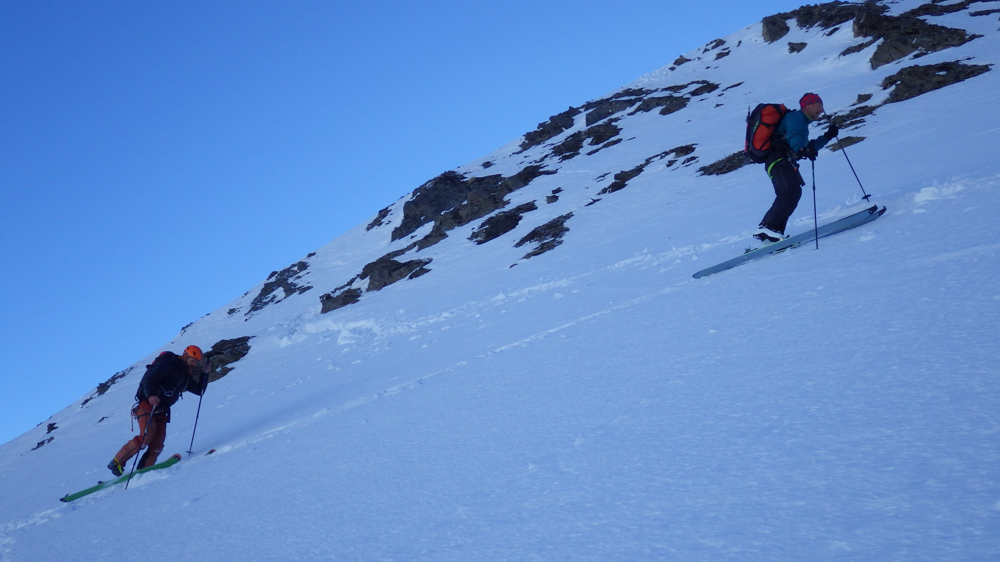

## Langs het oog

Voor wie het uitzicht van de La Muzelle kent, en de mythe rond het "L'Œil de la Muzelle" die Les Deux Alpes constant in de gaten heeft. Het oog is GIGANTISCH, eens je er in de buurt van bent. Ziehier, linksboven op deze foto.

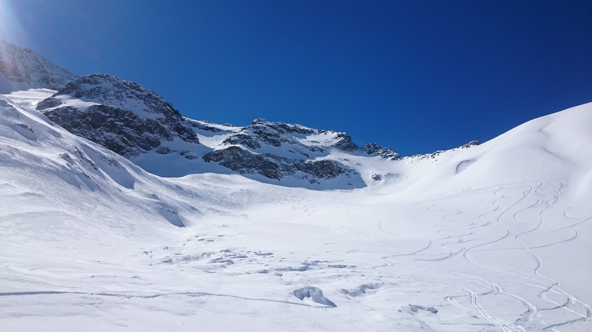

## De weg naar beneden

Na twee dagen zwoegen, en 30 minuten genieten, sta je dus weer beneden. Aan de voet van de berg die je twee dagen daarvoor vol goeie moed wou overwinnen. Het was het meer dan waard.

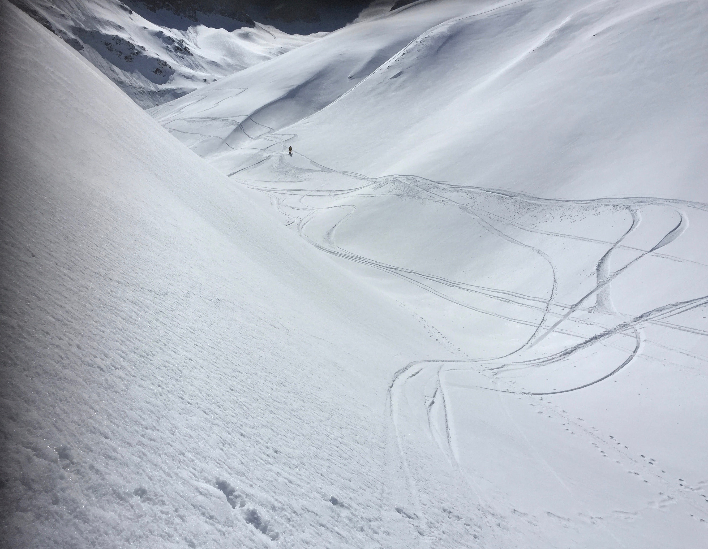
