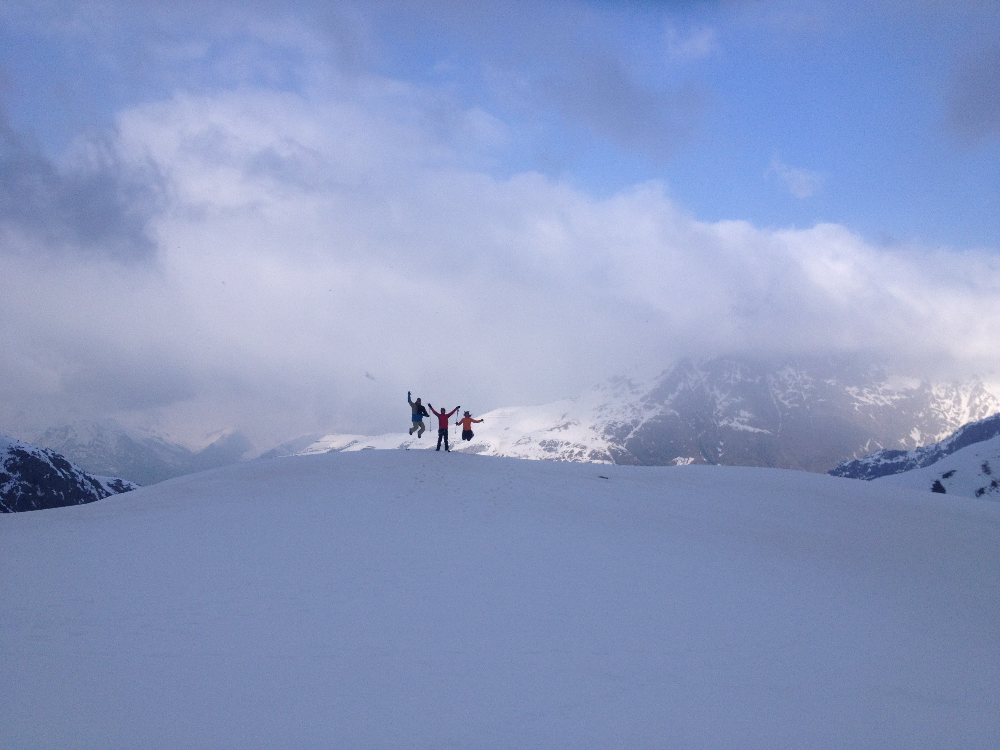
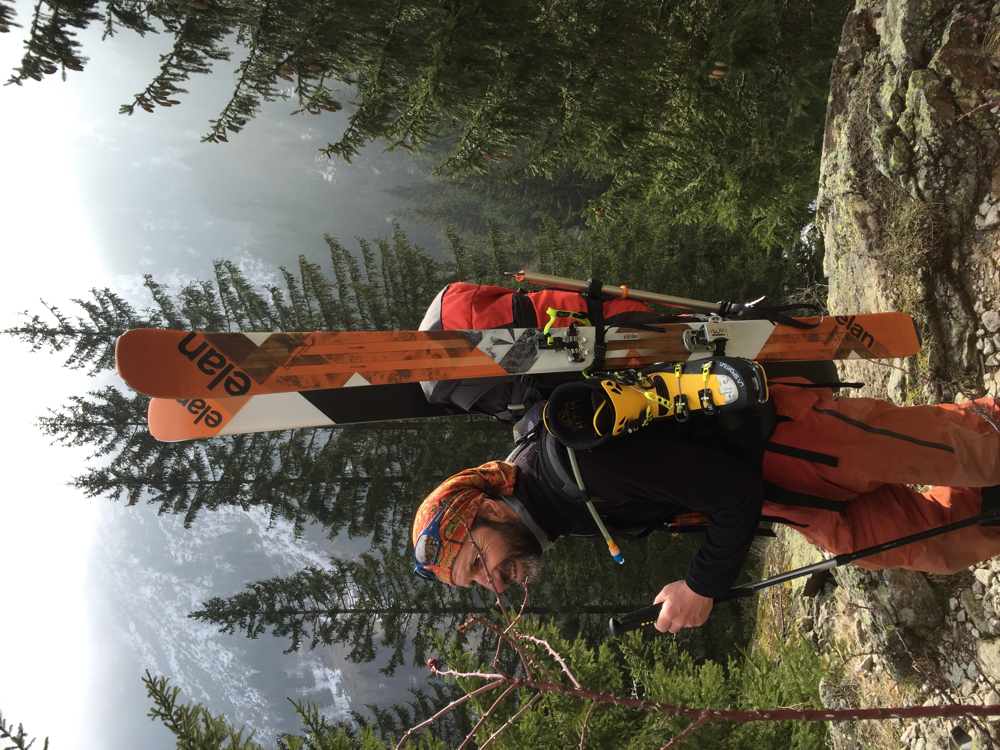
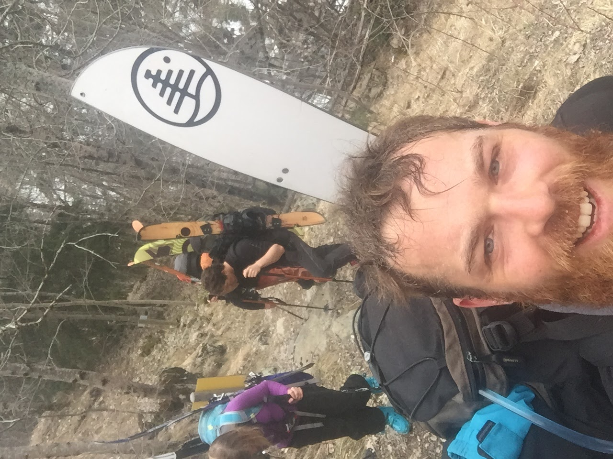
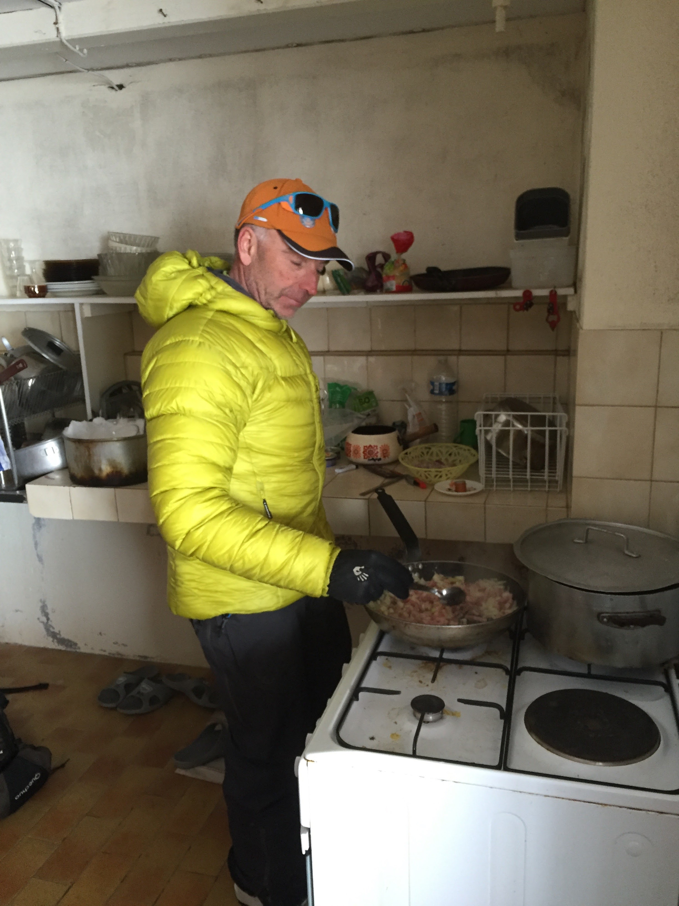
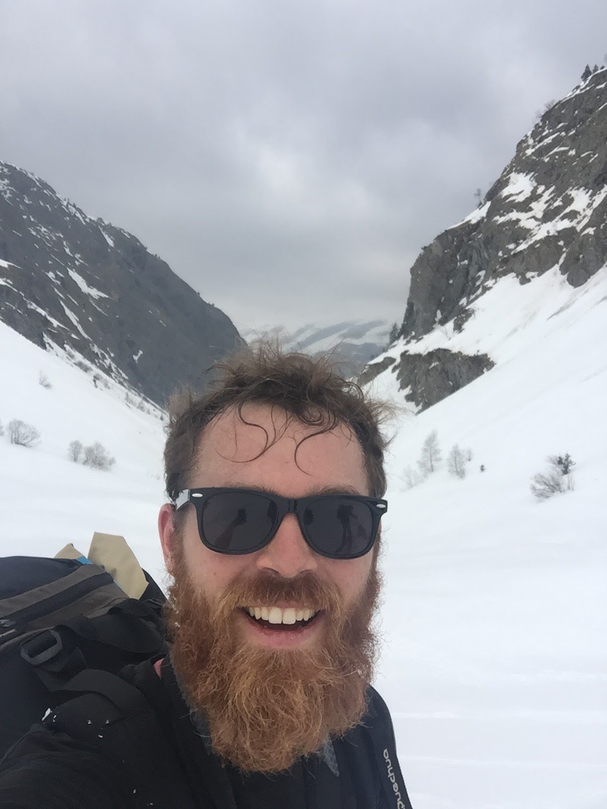
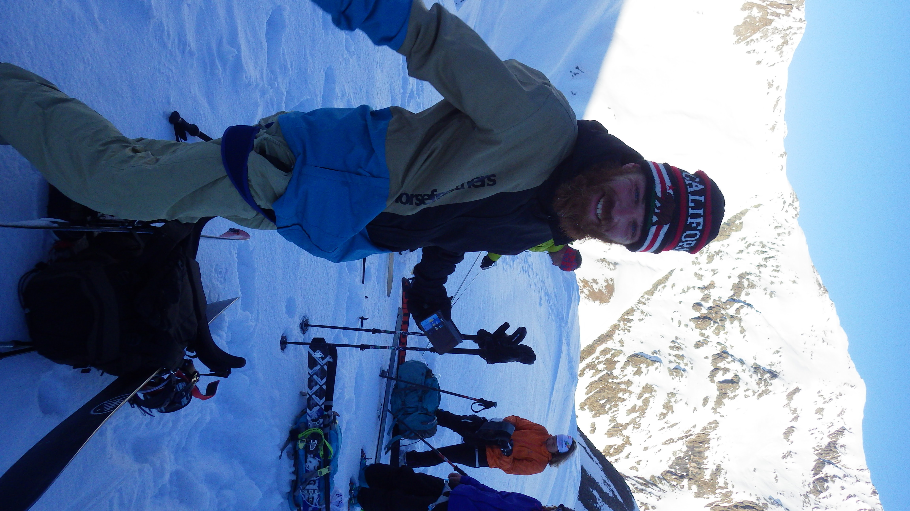

## Oh my..what an experience!

Een unieke ervaring. Iedereen die al eens in Les Deux Alpes geweest is, heeft deze mythische berg willens nillens sowieso al op het netvlies gehad. De hoofdstraat in het dorp heet Avenue de la Muzelle en lijkt je letterlijk de berg op te brengen..

Deze tweedaagse tocht doe je niet zomaar. Dat jaar vertoefde ik er het hele seizoen, en we waren diep in maart de eerste groep die hem beklom. Heel het dorp, alle locals zijn in de ban van de berg die dagelijks op hen neerkijkt, en heel het dorp heeft het dus ook geweten als iemand de La Muzelle gaat beklimmen.

Omdat ik daar in de lokale klimclub zat, had ik het geluk om daar heel wat locals te leren kennen met dezelfde passies. Hun projectje dat jaar was La Muzelle, en daarvoor namen ze een locale gids onder de armen. Dus mét gids en enkele ervaren klimmers, die allen over een topconditie beschikten, ondernamen we de tocht.

<iframe width="560" height="315" src="https://www.youtube.com/embed/3SVywCHaIDs" frameborder="0" allow="accelerometer; autoplay; encrypted-media; gyroscope; picture-in-picture" allowfullscreen></iframe>

## Eerste deel: Venosc tot Lac de La Muzelle

Het was een warme winter, en de sneeuw was in het dorp van Venosc (op minder dan 1000 meter) al fel verdwenen. Het eerste deel werd dus hiken, met al ons materiaal op onze rug.

## Overnachten

Als je in het holst van de nacht vertrekt, en een ervaren tourskiër bent, kan je de tocht in één keer doen. Echter, als je maar in de late namiddag de top bereikt, en met de warmte van midden maart al (in volle zon), heb je heel veel meer gevaar op lawines zijn het snowboarden/skiën naar beneden. Bovendien is het ook aangenaam om de tocht in 2 dagen te doen. Er is een refuge, die enkel bemand is in de zomer, aan het Lac de la Muzelle, ergens in het midden op de tocht. De vertrekken van in de zomer zijn dicht, maar er is een mini hutje bij die steeds open is, met een keukentje en enkele stapelbedden. Genoeg om er de nacht door te brengen en even te rusten op weg naar de top.

