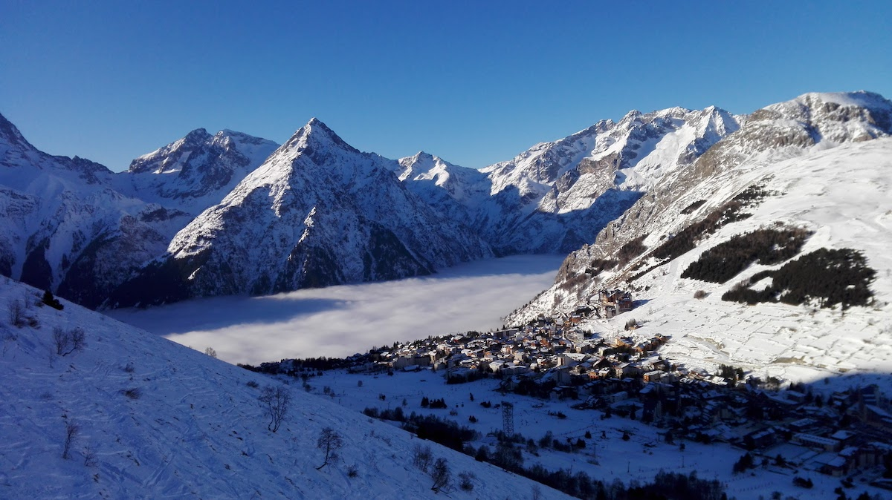
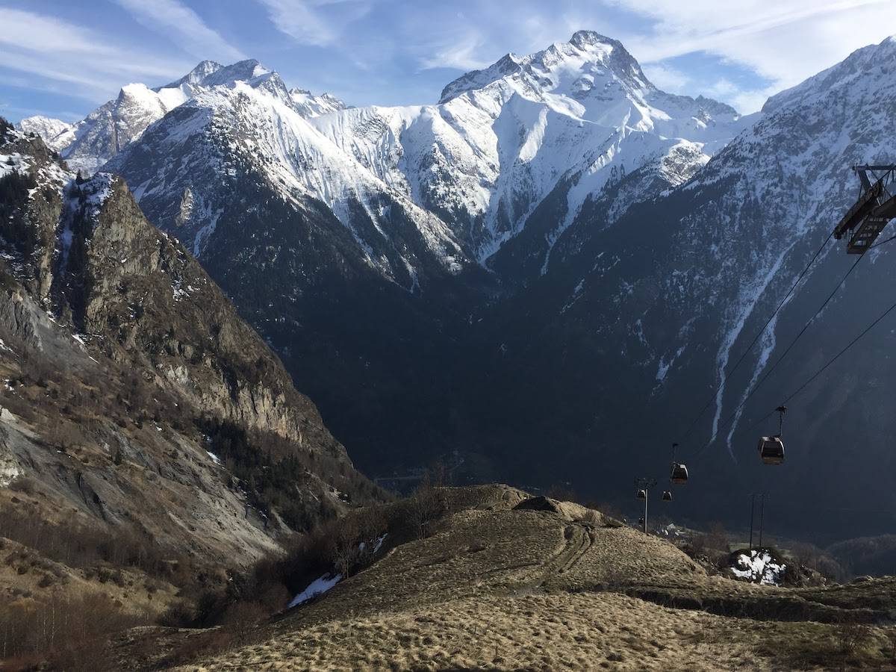
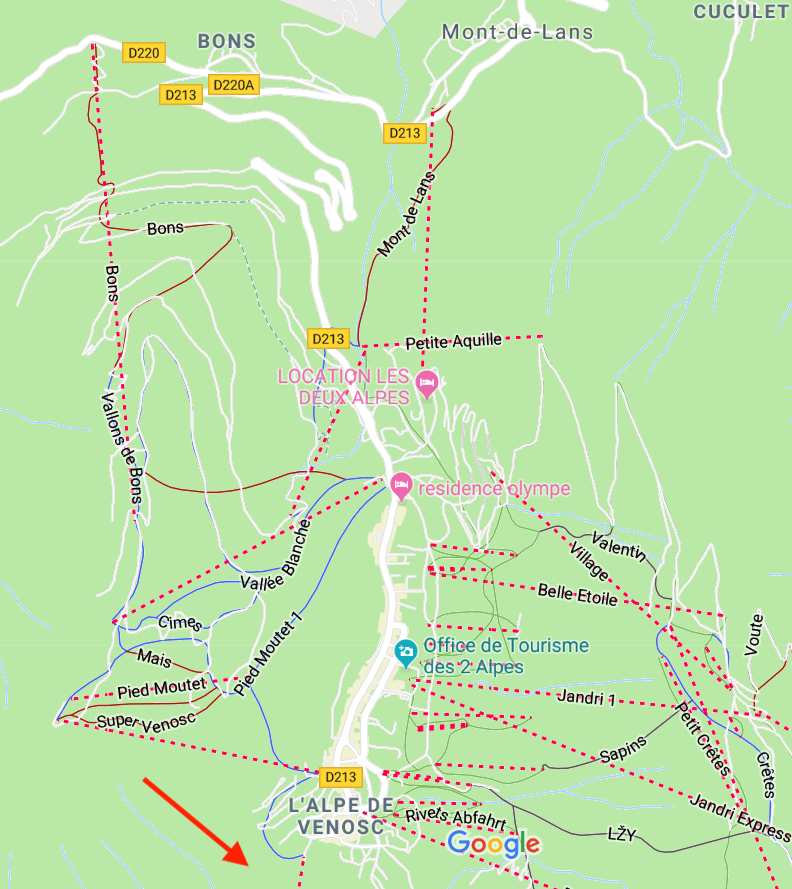
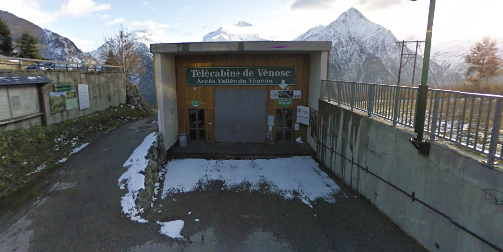
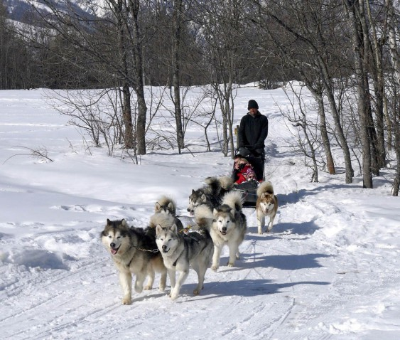
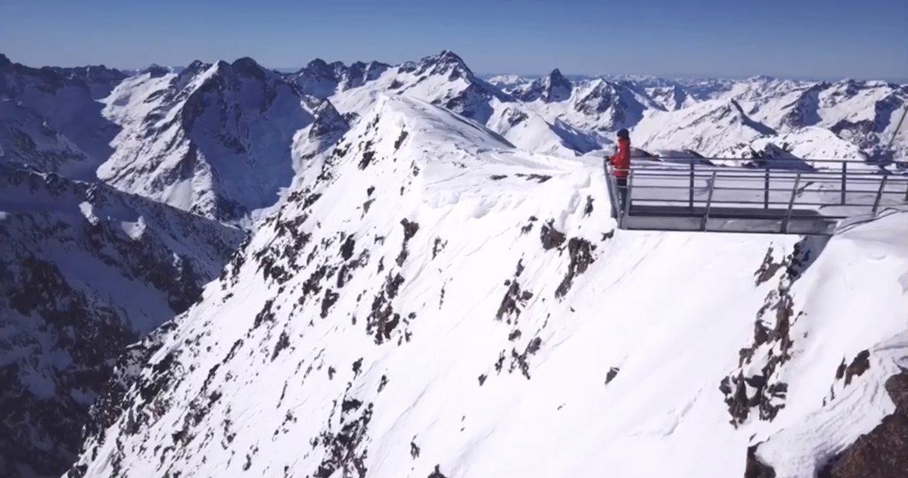
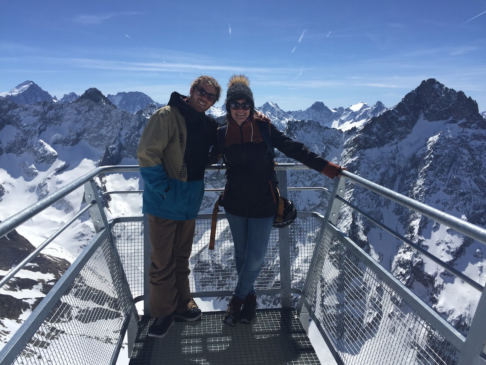

⛰️ Een kleine oplijsting van de leukste winterse wandelingen die ik ken in Les Deux Alpes.

### Dalwandeling naar Venosc

#### 3,5 km met 800 hoogtemeters - Dalen: 1u - Stijgen: 1u30 à 2u of met de Telecabine de Venosc

#### Vertrekpunt: Rue Sainte-Luc, Venosc

Les Deux Alpes is ontstaan uit twee dorpen, Mont de Lans enerzijds, Venosc anderzijds. Beide dorpjes liggen heel wat lager, en Les Deux Alpes werd dan het toeristische skigebied hogerop, beheerd door beide dorpen. Sinds 2018 werd Les Deux Alpes ook officeel een écht dorp. Als je het dorp binnenrijdt passeer je via Mont de Lans, het eerste gedeelte van Les Deux Alpes is dus de "Mont de Lans" coté, het verste deel is het "Venosc"-gedeelte.

#### Te voet naar beneden

Wandel dus naar het einde van het dorp, lang het rond puntje met de Polar Bear op de hoek (een aanrader voor rustige après ski) nog verder het dorp uit, tot waar de pijl staat getekend op onderstaand kaartje. Je kan ook de pijlen in het dorp volgen richting Venosc. Er is een dalliftje die je er kan nemen, Télécabine de Venosc.

Van daaruit is er een leuke wandeling volledig naar beneden tot in het authentiek dorpje van Venosc. Het dorp zelf ligt op 800m hoogte, Les Deux Alpes op 1600, dus de tocht is 800 hoogtemeters op een afstand van 3,2 km. Het is dus een korte steile tocht. Reken toch op een uurtje voor de afdaling.

In het kleine authentieke dorpje is de tijd een beetje blijven stilstaan. Er zitten er nog wat ambachten, leuke winkeltjes, en je kan er in enkele locale café'tjes een soepje gaan drinken of een taartje gaan eten bij het gezellige haardvuur. De vallei op zich is ook een uitvalsbasis voor heel wat mooie wandeling rondom Venosc en in het Parc des Ecrins.

Daarna kan je met een gerust gemoed de Télécabine terug naar boven nemen. De echte sportievelingen kunnen uiteraard ook de weg naar boven terug te voet afleggen. Een uitdaging!

### Rustige Wandeling op de "kleine Alp", richting Molière

#### 7 km in 2u, heen-en terug, relatief vlak

#### Vertrekpunt: Avenue de la Muzelle, Mont de Lans - Télésiège de Vallée Blanche

Deze gematigde wandeling brengt je in contact met de natuur en de skiërs, ze begint aan de lift Vallée Blanche aan de Mont de Lans kant, vlakbij de informatie kiosk op het rond punt in het begin van het dorp.

Achter de lift van Valleé Blanche loopt er een klein weggetje die voorbehouden is voor wandelaars (piétons). Let wel op van de skiërs, want 400 meter verder kruis je een piste om daarna verder te wandelen op het licht steigende pad.

Daarna draait het pad verder rond de berg en kom je in een volledig ander uitzicht, je kan er beneden het "grote" Bourg d'Oisans zien liggen en in de verte aan de rechterkant zie je ook de imposante bergen van Alpes d'Huez liggen.

Eens je achter de berg bent verdwenen kom je wat tussen de bomen, het is hier ergens op dit pad dat je ook een roede wolven of husky's (?) kan zien. Wees niet bang, ze zijn (helaas) vastgebonden. Je kan er tegen betaling een ritje mee doen.

### Grotte de glace en wandelroute bovenop de berg

#### Must-do: Easy walk, maar een ticket voor de liften kopen is een voorwaarde

#### Vertrekpunt: Centre de village, de Jandri lift

Wat je als wandelaar zeker moet doen als je in Les Deux Alpes bent is - op zijn minst één dag - een liftenpas nemen om de wandelroutes en "things to do" in de hogere regionen van het gebergte te verkennen. Laat je informeren door de mensen achter de balie van de ski loketten, er is ook een speciaal plannetje met de wandelingen en de liften die je als wandelaar wel en niet mag nemen.

##### Wat je zeker moet doen

* De grotte de Glace onderaan de Gletcher, aan de Signal piste. Daarvoor neem je eerst de twee grote cabines van de Jandri naar boven.
* Het viewpoint bovenaan de gletcher. Nadat je de twee grote cabines nam van de Jandri, kan je bovenaan ook nog de ondergronde "funiculaire" (trein) nemen tot helemaal bovenaan. Bovenaan kan je volop genieten van een zalig uitzicht op één van de daken van Europa.

##### Tips

* Als je geen skiër bent, hou dan zeker je ogen en oren open, want deze dag stelt je in staat om toch eens van dichtbij te zien waarom al die mensen nu toch zo verzot zijn op dat skiën.
* Op de pistes zijn ook hier en daar restaurants en bars, hier kan je even pauzeren om, afhankelijk van de weer condities, in een ligzetel te genieten van de zon, of om op te warmen binnen.
