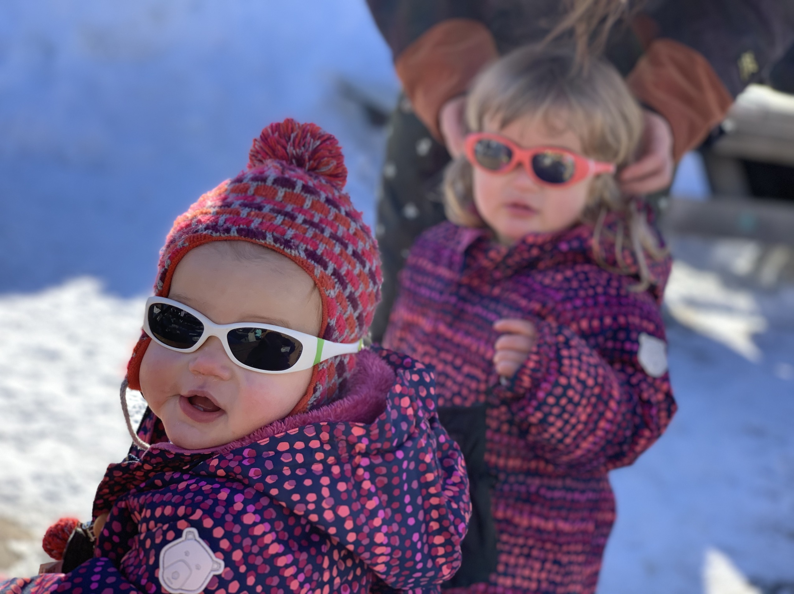

Wil je met je hele kleine kids naar de Alpen en toch op een plank of een lat staan? Het kan.

We gingen met ons viertjes naar Les Deux Alpes om er het begin van 2020 te vieren. We maakten samen enkele leuke wandelingen, de kids zijn allebei zot van hun sleetje, waardoor we leuk en zonder veel moeite [lange wandelingen konden maken door de sneeuw](/wandelen-met-kleine-kids).

Maar soms wil je ook wel eens met zijn tweetjes er tussenuit, en wil je nog eens op die plank of latten staan! Geen nood, in Les Deux Alpes kan je ze [in een goeie creche of infanterie achterlaten](https://www.les2alpes.com/en/facilities-for-children-childcare.html), of een hele rits aan babysits contacteren. Sommige komen bij je ter plaatse, andere hebben een soort mini-opvang bij hun thuis.

De creche is er voor de hele kleintjes tot 2 jaar, de infanterie is er voor de +2 jarigen. Vanaf 3 kan je ze ook bij ESF zelf op de latjes zetten.

In de week van oud naar nieuw kan je het best wel de creche of infanterie op voorhand reserveren. In de andere weken is er meestal in de week zelf ook wel nog plaats. Vergeet wel zeker je vaccinatieboekje niet. Weet ook dat deze plaatsen vragen om even een paar uurtjes te komen wennen alvorens ze achter te laten.

Wil je het liever wat kleinschaliger en met minder "gedoe", dan kan je ook gewoon de gsm-lijst afgaan die je bij het Office de Tourisme van Les Deux Alpes kan verkrijgen. Bij elke babysit staat, naast zijn gsm-nummer, een naam met wat uitleg over zijn/haar (meestal haar 😊) ervaring en hun leeftijd opgelijst.

Wij hadden twee hele goeie ervaringen met de babysits van de lijst, de creche en de infanterie zagen er ook heel leuk uit voor de kids, maar die waren helaas volzet.
