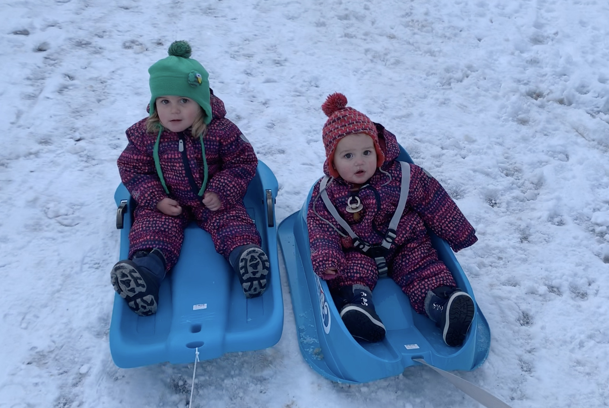

Een kid van 1+ en eentje van 2+, daar kan je niet mee op een plank of een lat staan. Toch moet dat je niet tegenhouden om naar de winterse bergen te gaan.

> Een tip: koop jezelf een sleetje! Het weegt (en kost) minder dan een draagrukzak, en de kiddo's vinden het even dikke fun en vallen er even gemakkelijk in slaap 😄.

En het hoeft heus niet direct een op en top professionele Pulka te zijn om dagtochten te gaan doen. 15 tot 20 euro is wat je kwijt bent voor zo'n sleetje (weliswaar en helaas van plastiek), maar je kan er heerlijk mee op stap.

## Van de Vallée Blanche, over Bergerie Kanata, naar Bons

De tweede dag na onze aankomst dachten we aan een klein verkennend tochtje tot aan Bergerie Kanata, op de Vallée Blanche. Gewoon iets drinken in de zon, en terug. Was het plan. Onze jongste lag na 2km al in slaap in het sleetje 😴. Hilarisch.

Het zag ernaar uit dat iedereen het wel naar zijn zin had, dus we deden er nog een kleine ommetje richting Bons bij!

Mooie wandeling, waarbij we misschien 15 man zijn tegengekomen! Superweinig, wetende dat het heel mooi weer was en dat eind december de drukste periode van het jaar is in Les Deux Alpes!

<iframe class="embedly-embed" frameborder="0" scrolling="no" allowfullscreen src="https://cdn.embedly.com/widgets/media.html?src=https://www.relive.cc/view/vYvrD1z3AL6/widget?r=embed-site&url=https://www.relive.cc/view/vYvrD1z3AL6?r=embed-site&image=https://www.relive.cc/view/vYvrD1z3AL6/png?x-ref=embed-site&key=f1631a41cb254ca5b035dc5747a5bd75&type=text/html&schema=relive" width="800" height="626"></iframe>

### Sneeuwraketten vs Wandelschoenen

Het had twee dagen ervoor gesneeuwd, en we dachten dat sneeuwraketten misschien wel handig waren.. Uiteindelijk zijn we gewoon vertrokken op onze normale wandelschoenen en bleken de sneeuwraketten absoluut overbodig. Juiste keuze gemaakt dus. 👍

Het pad is heel mooi geëffend voor de wandelaars. Je ziet er regelmatig groepen, mét gids en sneeuwraketten wandelen, maar dat is absoluut niet nodig. Deze wandeling kan je gerust zonder gids en zonder sneeuwraketten aanvatten. ❄

Maak wel dat je goede waterdichte wandelschoenen hebt. Ikzelf maak, sinds ik ben beginnen trailrunnen, altijd gebruik van mijn waterdichte trailschoenen ([Salomon Speedcross schoenen](https://partner.bol.com/click/click?p=2&t=url&s=1035841&f=TXL&url=https%3A%2F%2Fwww.bol.com%2Fbe%2Ff%2Fsalomon-speedcross-vario-2-heren%2F9200000093485284%2F&name=Salomon%20SPEEDCROSS%20VARIO%202%20Hardloopschoenen%20He...)). Ik vind dat veel aangenamer stappen dan in die lompe bergschoenen.

## Naar Molière

Op de laatste dag van 2019, prachtig weer, beslisten we om met de kids een wandeling te gaan doen naar Molière. Eén sleetje, één draagrukzak. We wisselden de kids af tussen draagrukzak en sleetje. Beide zitten over het algemeen heel graag in de draagrukzak, maar beide zaten ze nu nog liever in het sleetje.😄 Het werd een heel leuk uitstapje!

<iframe class="embedly-embed" frameborder="0" scrolling="no" allowfullscreen src="https://cdn.embedly.com/widgets/media.html?src=https://www.relive.cc/view/vrqodwD3Kyv/widget?r=embed-site&url=https://www.relive.cc/view/vrqodwD3Kyv?r=embed-site&image=https://www.relive.cc/view/vrqodwD3Kyv/png?x-ref=embed-site&key=f1631a41cb254ca5b035dc5747a5bd75&type=text/html&schema=relive" width="800" height="626"></iframe>
