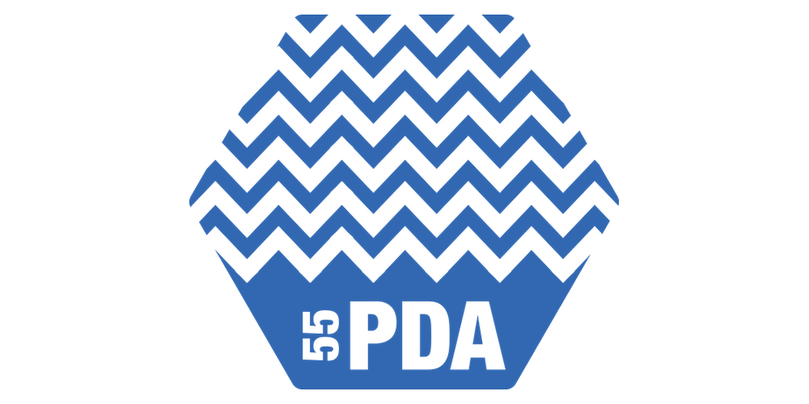
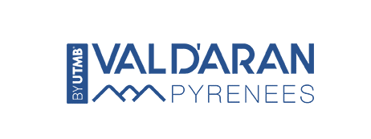

_Een nieuw jaar, een nieuwe uitdaging_ in het trailrunnen. Grenzen weer een beetje verleggen. 55 km, iets verder dan vorig jaar. 3100 hoogtemeters, +/- hetzelfde als in de [Summit Trail](/summit-trail-in-l2a).

Op aanraden van een collega voor de Peades d'Aigua gekozen in de valei d'Aran in de Pyreneeën. Dit nieuwe UTMB-event host 3 verschillende afstanden.
Het "kleine zusje", zoals zij het noemen, wordt - te midden van het EK voetbal - mijn uitdaging van 2020. 😄

## 🗻 De bergen

De Pyreneeën, een nieuwe wereld voor me! Ik ben benieuwd.. Maximum hoogte wordt 2600m, deze keer dus waarschijnlijk geen sneeuw, geen gletcher, maar wel zeer ruw terrein.

## 🐎 Ambities

Naast de Peades d'Aigua vinden er nog twee UTMB wedstrijden plaats. Eén van 105 km, de Camins de Hèr met 6500 hoogtemeters, en de magische Torn dera Val d'Aran, een wedstrijd van maar liest 162 km met 10600 hoogtemeters.

De ambitie is simpel: de wedstrijd uitlopen. Daarnaast wil ik er vooral inspiratie opdoen van de atleten die zich aan **het dubbele en driedubbele van mijn afstand** wagen. Eens opsnuiven of zoiets ook ooit mijn terrein wordt of niet.

## 🎱 ITRA punten

Daarnaast vind ik het wel cool om eens deel te nemen aan een wedstrijd die niet zomaar open is. Om te mogen deelnemen moet je namelijk in het bezit zijn van <a href="https://itra.run/" target="_blank">ITRA-punten</a> 🎢. Meerbepaald moet je al een wedstrijd gelopen hebben met een waarde van 2 ITRA punten na januari 2018. Gelukkig was mijn wedstrijd in L2A vorig jaar zo-eentje. 👌 Als ik deze wedstrijd deze zomer weet te finishen, zal ik weer 3 ITRA-punten en 9 "Running stones" rijker zijn. 😎

## 📹 Training

Vorig jaar in de Alpen heb ik gemerkt dat 3000 hoogtemeters in het hooggebergte nog iets anders is dan hoogtemeters opbouwen op de Gentse skiberg of in de Belgische ardennen.. Toen zei ik: "Het is **onmogelijk** om je in België op zoiets voor te bereiden!" De hellingen, zowel naar boven als naar beneden zijn gewoon zoveel steiler dan in ons land.. en het blijft maar duren. Je mag dan nog de steile skiberg van 30m in Gent 50x opknallen om 1500 hoogtemeters te hebben, dan nog ben je niet voorbereid op die voortdurende steilheid.. Zeker naar beneden was dit voor mij vorig jaar een helse ervaring. Vanop de sneeuwgrens meer dan 1000 hoogtemeters afdalen over een afstand van 10 km heeft me vorig jaar pijn gedaan.. Terwijl ik in België, dus op minder steil terrein, net een heel goeie daler ben..

Nog even nadenken hoe ik hier het beste op train. Maar één ding ben ik aan het overwegen, de aankoop van een goeie loopband om hoogtemeters te trainen. Ideaal om toch iets te kunnen doen op de avonden dat ik thuis moet blijven als de vrouw uit huis is en de kids liggen te knorren. De <a target="_blank" href="https://partner.bol.com/click/click?p=2&t=url&s=1038869&f=TXL&url=https%3A%2F%2Fwww.bol.com%2Fbe%2Fp%2Floopband-nordictrack-commercial-x7i-incl-hartslagband%2F9200000116254465%2F&name=Loopband%20NordicTrack%20Commercial%20X7i%20-%20incl.%20ha...&subid=loopband%20nordictrack"> loopbanden van NordicTrack</a> zijn een grote kanshebber, die kunnen tot wel 40% hellingsgraad gaan.💪
